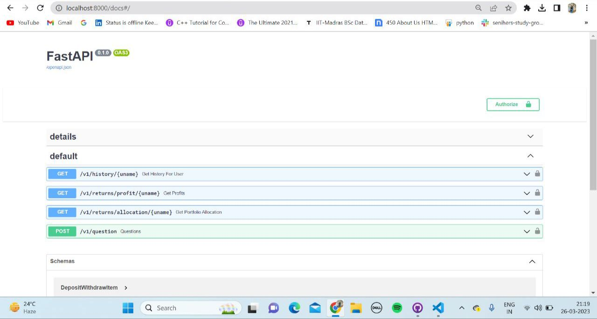
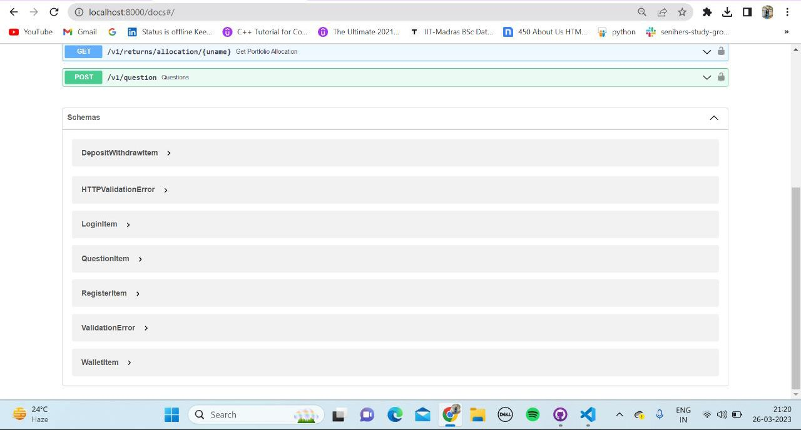

# Backend

Cash By Chance is a modern world e-wallet. It allows users to automatically save some portion of money from their payments and put it into a savings wallet and also invest it automatically to the funds suitable for the user according to his profile.

## How to Install and Run the Project

##### Packages and Libraries to be installed:

1. fastapi==0.95.0
2. mysql_connector_repackaged==0.3.1
3. pandas==1.4.4
4. pydantic==1.10.6
5. PyJWT==2.6.0
6. uvicorn==0.21.1

   
##### Steps to run backend:
1. Install XAMPP and create a database named "cash_by_chance" in phpmyadmin
2. Create tables in "cash_by_chance" db using commands written in DB.sql
3. Open XAMPP and start Apache and MySql Server
4. Open two terminals
5. Go to backend directory in one of them and frontend in the other
6. In the backend one, run "python _init_.py"
7. In the frontend one, run "npm run dev"

##### REFER TO THE README OF REBALANCING FOLDER TO UNDERSTAND THE WORKFLOW OF REBALANCING.
## How to use the project

Once all this is set up you can see the api swagger documentation in the following link-
http://localhost:8000/docs

